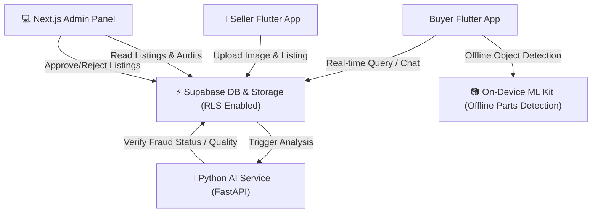

# 🚗 AutoConnect LK (AutoLK)
### *The Next-Generation AI-Powered Sri Lankan Auto Parts Marketplace*

[](https://flutter.dev)
[](https://nextjs.org)
[](https://fastapi.tiangolo.com)
[](https://supabase.com)
[](https://python.org)

AutoConnect LK (AutoLK) is a premium, secure, and highly optimized digital marketplace platform designed to bridge the gap between automobile part sellers and buyers in Sri Lanka. By pairing an **offline-first AI Vision mobile client** with a **real-time marketplace engine** and a **smart Next.js administrative console**, AutoLK delivers a high-performance ecosystem for secure trade.

---

## 📐 System Architecture

Below is the interaction and data flow diagram of the AutoLK ecosystem:



---

## 🌟 Key Pillars & Deep Dives

### 1. 📷 Offline AI-Powered Vision Intelligence
AutoLK utilizes an **on-device machine learning model** (powered by Google ML Kit and Custom TensorFlow Lite models) integrated directly within the Flutter application's camera feed.
- **No Internet Required**: Instantly identifies automotive parts (e.g., *Brake Pads, Headlights, Radiators, Spark Plugs*) in real-time.
- **Zero Latency**: Eliminates network roundtrip delays, protecting user engagement even in remote Sri Lankan regions with poor cellular coverage.

### 2. 🧠 Cloud-Based AI Fraud & Quality Verification
When sellers post high-value listings, the **Python FastAPI AI Service** performs deep content analysis:
- **Image Authentication**: Detects duplicated web listings, stock image reuse, or mismatching metadata.
- **Fraud Engine**: Uses a lightweight PyTorch classifier to grade the part's condition (New vs. Used) and flags anomalies directly in the administrative dashboard.

### 3. 🛡️ Escrow-Supported Transaction Security
To protect buyers from fraudulent transactions, AutoLK incorporates a secure **escrow payment status flow**:
- Funds are locked securely inside the transaction state model.
- Funds are only disbursed to the seller once the buyer receives and verifies the part or the automated tracking confirmation clears.
- Fully protected by **Supabase Row-Level Security (RLS)** policies to ensure users can only access their own financial records and chat instances.

### 4. ⚡ Real-Time Negotiating & Communications
Powered by **Supabase WebSockets**, the in-app chat provides:
- Sub-millisecond instant messaging between buyers and sellers.
- Inline part attachment and secure bidding/negotiation workflows.

---

## 📂 Project Directory Structure

```text
├── mobile_app/         # Cross-platform Flutter Mobile Application for Android & iOS
│   ├── lib/
│   │   ├── core/       # Global themes, constants, routing configuration
│   │   ├── features/   # Feature modules (auth, buyer, seller, chat, camera, escrow)
│   │   ├── models/     # Shared data models (user, listing, order, message)
│   │   ├── providers/  # Global Riverpod state management providers
│   │   └── services/   # Supabase client integration and API hooks
│   └── assets/         # App icons, splash screens, and offline ML models
│
├── admin_panel/        # Next.js 14 web application for system administrators
│   ├── app/            # Main application router and view pages (dashboard, listings, fraud)
│   ├── components/     # High-fidelity dashboard widgets and tables
│   └── lib/            # Backend helper functions and Supabase SDK integration
│
├── ai_service/         # Python FastAPI server for cloud-based verification and NLP
│   ├── main.py         # Main API routes and entry point
│   ├── fraud_detection.py # Image mismatch and spam detection heuristics
│   └── image_recognition.py # PyTorch/TensorFlow deep-learning part classifier
│
└── final apk/          # Production-ready release candidates
    └── AutoLK_v2.apk   # Optimized 43MB split APK
```

---

## 🚀 Getting Started

### 📦 One-Click Windows Launcher
For a seamless local demonstration, double-click the `run_adminpanel.bat` file in the root folder.
This script will automatically:
1. Verify Node.js and dependencies.
2. Initialize and open the administrative dashboard in your browser.

---

### 🔧 Manual Setup Instructions

#### 1. Database Setup (Supabase)
1. Create a project on [Supabase](https://supabase.com).
2. Configure **Row Level Security (RLS)** policies for the following tables:
   - `profiles` (authenticated user profiles)
   - `listings` (public parts marketplace)
   - `messages` (private real-time buyer-seller conversations)
   - `orders` (escrow transaction tracker)
3. Set up a Supabase Storage Bucket named `parts-images`.

#### 2. Mobile App (Flutter)
```bash
cd mobile_app
flutter pub get
# Connect an Android/iOS device or emulator
flutter run
```

#### 3. AI Service (Python FastAPI)
```bash
cd ai_service
python -m venv .venv
source .venv/bin/activate  # On Windows use: .venv\Scripts\activate
pip install -r requirements.txt
uvicorn main:app --reload
```

#### 4. Web Admin Dashboard (Next.js)
1. Inside `admin_panel/`, create a `.env.local` file:
   ```env
   NEXT_PUBLIC_SUPABASE_URL=https://your-supabase-url.supabase.co
   NEXT_PUBLIC_SUPABASE_ANON_KEY=your-anon-key
   SUPABASE_SERVICE_ROLE_KEY=your-service-role-key
   ```
2. Launch the dev environment:
   ```bash
   cd admin_panel
   npm install
   npm run dev
   ```
   Open `http://localhost:3000` to view the dashboard.

---

## 🎯 Viva Key Highlights & Talking Points

- **Resource Optimization**: Built using on-device ML Kit, rendering standard 300MB+ models obsolete and compressing the APK size to an incredibly optimized **43MB** by splitting ABIs (`armeabi-v7a`, `arm64-v8a`).
- **Data Integrity**: Supabase PostgreSQL triggers automatically audit listing creations, instantly scheduling check tasks to the `ai_service` queue to flag fraud in real-time.
- **Modular Adaptability**: Clean Architecture and Riverpod make adding future payment gateways or upgrading neural networks incredibly straightforward.

---

*Prepared by Nilupul Induranga & Team with Antigravity AI*
